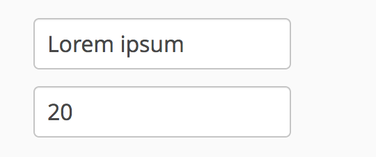

# How to bind your form to your domain model – the Vaadin 8 style

Lots of web applications require the user to input some data in order to manipulate it later.
This article shows how Vaadin makes this task easy to implement.

We will be using Vaadin 8 and Java 8 in this article.
The source code can be found at the following GitHub page: 
[https://github.com/SomeoneToIgnore/vaadin-binders](https://github.com/SomeoneToIgnore/vaadin-binders)

To launch the example, you can use jetty plugin, clone the project and run the following command in project directory: `mvn jetty:run`

## Basic example

This is how the basics work.
Let's create a form that allows the user to generate an image, basing on user input:
```java
public class BinderUI extends UI {
    private final TextField text = new TextField();
    private final TextField imageSize = new TextField();

    @Override
    protected void init(VaadinRequest vaadinRequest) {
        setContent(new VerticalLayout(text, imageSize));
    }
}
```

Now, let's define a corresponding class that will be responsible for storing the form input:
```java
public class ImageData {
    private String text;
    private int size;

    public ImageData(String text, int size) {
        this.text = text;
        this.size = size;
    }

    public String getText() {
        return text;
    }

    public void setText(String text) {
        this.text = text;
    }

    public int getSize() {
        return size;
    }

    public void setSize(int size) {
        this.size = size;
    }
}
```
Later on, we will address this class as _data class_ and its instances as _data objects_.

And the last thing left to do: the actual binding. For this action, we will need the `Binder` class from Vaadin framework.
Let's append the following lines to `init` method:
 
```java
Binder<ImageData> binder = new Binder<>();
// a shorthand method, if no extra configuration can be done
binder.bind(imageText, ImageData::getText, ImageData::setText);
// long way of binding, usually used for more complex bindings
binder.forField(imageSize).bind(
        imageData -> Integer.toString(imageData.getSize()),
        (imageData, formValue) -> imageData.setSize(Integer.valueOf(formValue))
);
```

That's it, now we have bound the data class to the form's contents. 

A few explanations of the api:
* There are two ways of binding to a field: `binder.forField` and `binder.bind`.

    In current examples, both of them do the very same thing: establish the binding between the form field and the data object field.
    * `binder.forField` can be used for more complex bindings, involving validation and conversions. 
    They will be described in later sections.
    * `binder.bind` form is just a shorthand, for cases when no validation or conversions are needed.
* Both ways need four things to be declared:
    * type of the data object that will be bound: `Binder<ImageData>`
    * what field of the form to bind to: `imageText` and `imageSize` in this case
    * how to get data for form field from object: `ImageData::getText` and `imageData -> Integer.toString(imageData.getSize())`
    * how to set data from form field to object: `ImageData::setText` and `(imageData, formValue) -> imageData.setSize(Integer.valueOf(formValue))`

After the binding is done, let's explore the possibilities it gives to us.

## Loading bound data

After binding is defined, we can use it to load the actual data into the form.

Vaadin provides the following api:
```java
binder.setBean(imageData);
```
The `setBean` method first writes data object fields into the form fields and then tracks form fields' changes to update the object. 

If we add this string to code above and start the application, we will see that our form is no more empty:


Now, whenever user changes the form contents, those changes will be written into corresponding objects using methods, 
specified in the binding.

The only exception for this case is a situation, when validation errors occur: if there are any, the bound object
will not be changed. Validation will be described in the later sections.

It is also important to notice that any consequent changes to a data object's state won't change the form.
```java
ImageData imageData = new ImageData("Lorem ipsum", 20);
binder.setBean(imageData);
// the form will display Lorem ipsum still 
imageData.setText("Test test");
// the form will display 20 still
imageData.setSize(300);
```

In order to turn the automatic update off, we need to call either `binder.removeBean()` or `binder.setBean(null)`.
The latter method also clears form contents.

## Validating user input

Let's have a look at the current state of the imageSize field binding:
```java
binder.forField(imageSize).bind(
        imageData -> Integer.toString(imageData.getSize()),
        (imageData, formValue) -> imageData.setSize(Integer.valueOf(formValue))
);  
```
bound form element is a `TextField`:
```java
TextField imageSize = new TextField();
```
that accepts all kinds of characters, not only numeric.
Non-numeric character input will cause obvious `NumberFormatException` because of the `Integer.valueOf(formValue)` 
binder setter expression.

In order to handle incorrect user input in a more convenient way, validators are used.
Let's define the requirements for user input:
* input should not be null or empty
* input string should be a positive integer

This can be achieved by using the following api:
```java
binder.forField(imageSize)
    .withValidator(string -> string != null && !string.isEmpty(), "Input values should not be empty")
    .withValidator(inputString -> {
        try {
            return Integer.valueOf(inputString) > 0;
        } catch (NumberFormatException ignored) {
            return false;
        }
    }, "Input value should be a positive integer")
    .bind(
            imageData -> Integer.toString(imageData.getSize()),
            (imageData, formValue) -> imageData.setSize(Integer.valueOf(formValue))
    );
```
Now, whenever the user inputs a string, a validation occurs, applying validators in order to be specified in the code, 
when updating the form and vice versa, when updating the object.

Let's see what we can do to improve the existing example.

## Converting user input

Sometimes it is better to represent some data in a different way, not as an input text field.
In those situations, the converters can help a lot.

By introducing a converter, we can reduce the number of string to integer conversions:
```java
binder.forField(imageSize)
    .withValidator(string -> string != null && !string.isEmpty(), "Input values should not be empty")
    .withConverter(Integer::valueOf, String::valueOf, "Input value should be an integer")
    .withValidator(integer -> integer > 0, "Input value should be a positive integer")
    .bind(ImageData::getSize, ImageData::setSize);
```

It is also important to notice that Vaadin has numerous useful converters that may come in handy.
For instance, it has a String to Integer converter that allows us to replace the previous example with
```java
binder.forField(imageSize)
    .withValidator(string -> string != null && !string.isEmpty(), "Input values should not be empty")
    .withConverter(new StringToIntegerConverter("Input value should be an integer"))
    .withValidator(integer -> integer > 0, "Input value should be a positive integer")
    .bind(ImageData::getSize, ImageData::setSize);
```

As with validators, multiple converters can be added, both validators and converters are executed 
in order to be added in the code, when updating the form and vice versa, when updating the object.

You may have noticed that StringToIntegerConverter allows us to specify a validation error message.
This shows one important feature of converters and validators: if any kind of exception occurs inside a validator or converter, 
a `ValidationException` is thrown.
This allows Vaadin framework to handle exceptions properly, without propagating them to upper levels of the application.

But, if an exception occurs during conversions made in lambdas, for instance, like these:
```java
binder.forField(imageSize).bind(
        imageData -> Integer.toString(imageData.getSize()),
        (imageData, formValue) -> imageData.setSize(Integer.valueOf(formValue))
);
```

the `RuntimeException` will be thrown and it will not be handled normally, as `ValidationException`.
That's why converting values via `withConverter` is more preferable.

### Subscribe to form fields' value changes

Every time the user updates the form, an event is fired if a binder was attached to the form.
We can process these events in order to react to them:
```java
binder.addStatusChangeListener(e -> {
    System.out.println("Change introduced validation errors: " + e.hasValidationErrors());
    System.out.println("Form was changed" + e.getBinder().hasChanges());
});
```

Be aware, that if `hasValidationErrors` method returns `false`, this only means that the change that triggered the event
did not introduce any new validation errors: other errors may still be present in the form, making it invalid.

To check if form is valid, we can use the following handy method: `e.getBinder().isValid()`.

## Advanced binding

Sometimes, automatic bean update via `binder.setBean` is not convenient.
Vaadin framework provides an alternative api for those cases.

### Load data from data objects to form

In order to update form contents only once, `readBean` method can be used.

```java
ImageData imageData = new ImageData("Lorem ipsum", 20);
binder.readBean(imageData);
```

This method can be also used to clean bean all form fields:
```java
binder.readBean(null);
```

Note that this call modifies the corresponding data object, a null will be set to all the data object's properties, whenever
possible, propagating `ValidationException` in other cases.

### Load data from form to data object

Of course, the opposite operation is possible too, to write data from form input to object without subscribing to any form changes. 
Use the following code: 

```java
try {
    binder.writeBean(imageData);
} catch (ValidationException e) {
    // do something with the exception
    e.printStackTrace();
}
```

Another way is to check the return value:
```java
boolean saved = binder.writeBeanIfValid(imageData);
if (saved) {
    // do something
} else {
    // do something else
}
```

### Declarative binding

When there are many fields in form and model, it gets cumbersome to define every binding manually.
To eliminate unnecessary boilerplate code, `bindInstanceFields` method can be used.

In order to bind properties declaratively, we should have an object with fields we want to bind.
As you may see from the `bindInstanceFields` method signature, the type of the object does not matter.
In our case, `BinderUI` has two fields defined, both of them are used in the same binding:
```java
public class BinderUI extends UI {
    private final TextField text = new TextField();
    private final TextField imageSize = new TextField();

    // ... rest of the file goes here
 }
```

That's exactly what we need, so, we can put the `binder.bindInstanceFields(this);` line right after the last validator 
usage in the `init` method of `BinderUI` class.

We've specified the form elements that are used in the binding, so what about data class for them? 
A special constructor is used in this case, `Binder<ImageData> binder = new Binder<>(ImageData.class);` 
that defines the class that would be used as data class.

These two actions automatically set a relation between `ImageData` class' fields and two text fields, defined in `BinderUI`.
For every text field in a form, the binder will try to find a property with the same name and corresponding type (`String` for `TextField`).

Let's remember the data object field structure: 
```java
public class ImageData {
    private String text;
    private int size;

    // ... rest of the file goes here
 }
```

It is clear that `TextField text` is automatically bound to `String text` field which means that the line 
`binder.bind(imageText, ImageData::getText, ImageData::setText);` is obsolete and we can get rid of it. 

The other form field, `TextField imageSize` does not match the second field from data object, `int size`.
We can fix this issue, by adding implicit mapping and implicit data conversion.

Implicit mapping is set via `@PropertyId` annotation set for form fields.
It allows to specify a different name for a data object field that would be mapped to a corresponding 
form field.

```java
// It is explicitly stated, that this field is mapped to a property with name `size`
@PropertyId("size")
private final TextField imageSize = new TextField();
```

A few words about the limitations:
* No binding will be set if the class and form field's names won't match.
* If names match, but types do not, the framework will throw an exception.

What about conversion?
Good news: all validations and conversions work in declarative bindings just as fine as in regular ones.
We've already taken care of it, using `StringToIntegerConverter` in one of the bindings, 
so the only thing to keep in mind is to put `binder.bindInstanceFields(this);` after binding with conversion is defined.

One last thing to notice: when using the `binder.bindInstanceFields`, we can use `binder.forMemberField` instead of the `binder.forField` 
which allows to omit the `bind` call for every field pair that has the same names or annotated with the `@PropertyId`. 

## Putting it all together

This article showed lots of things that are possible with Vaadin Framework. 
* We can bind any java class to the form input fields
* We can customize binding by adding validators and converters
* We can update bound objects and form fields, either automatically or manually
* We can track user input, validate it and react accordingly
* We can bind forms and data objects fast and easy with declarative binding

Let's put all the gathered knowledge together in a final version of the example.

The `ImageData` class was not changed since its last appearance.

As for the `BinderUI`, the simple implementation can be represented with the following class:
```java
public class BinderUI extends UI {
    // Field that would be used by binder.bindInstanceFields
    private final TextField text = new TextField();

    // Field that would be used by binder.bindInstanceFields
    // It is explicitly stated, that this field is mapped to a property with name `size`
    @PropertyId("size")
    private final TextField imageSize = new TextField();

    @Override
    protected void init(VaadinRequest vaadinRequest) {
        // crate a binder for a form, specifying the data class that will be used in binding
        Binder<ImageData> binder = new Binder<>(ImageData.class);

        // specify explicit binding in order to add validation and converters
        binder.forMemberField(imageSize)
                // input should not be null or empty
                .withValidator(string -> string != null && !string.isEmpty(), "Input values should not be empty")
                // convert String to Integer, throw ValidationException if String is in incorrect format
                .withConverter(new StringToIntegerConverter("Input value should be an integer"))
                // validate converted integer: it should be positive
                .withValidator(integer -> integer > 0, "Input value should be a positive integer");

        // tell binder to bind use all fields from the current class, but considering already existing bindings
        binder.bindInstanceFields(this);

        // crate data object with predefined imageName and imageSize
        ImageData imageData = new ImageData("Lorem ipsum", 2);

        // fill form with predefined data from data object and
        // make binder to automatically update the object from the form, if no validation errors are present
        binder.setBean(imageData);

        binder.addStatusChangeListener(e -> {
            // the real image drawing will not be considered in this article

            if (e.hasValidationErrors() || !e.getBinder().isValid()) {
                Notification.show("Form contains validation errors, no image will be drawn");
            } else {
                Notification.show(String.format("I will draw image with \"%s\" text and width %d\n",
                        imageData.getText(), imageData.getSize()));
            }
        });

        // add a form to layout
        setContent(new VerticalLayout(text, imageSize));
    }

    @WebServlet(urlPatterns = "/*", name = "MyUIServlet", asyncSupported = true)
    @VaadinServletConfiguration(ui = BinderUI.class, productionMode = false)
    public static class MyUIServlet extends VaadinServlet {
    }
}
```

That's it for this time, for more detailed information, please refer to the [documentation](https://vaadin.com/docs/-/part/framework/datamodel/datamodel-forms.html)

Source code for this article can be found at [https://github.com/SomeoneToIgnore/vaadin-binders](https://github.com/SomeoneToIgnore/vaadin-binders)
